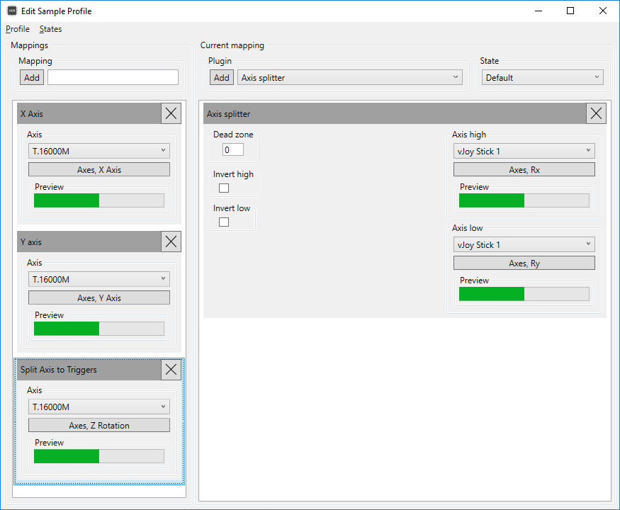

# Universal Control Remapper
     

Universal Control Remapper is a complete rewrite of the original [UCR](https://github.com/evilC/UCR), created in collaboration with [evilC](https://github.com/evilC/).

Universal Control Remapper is a Windows application which allows the end-user to remap any inputs from devices, such as keyboards, mice, joysticks, racing wheels, eye trackers, etc. to virtual output devices. Remapping is achieved by transforming inputs through plugins to a desired output device.

## Table of Contents ##

- [Downloads](#downloads)
- [Documentation](#documentation)
- [Support / Discussion / Feedback](#support--discussion--feedback)
- [Features](#features)
- [Device support](#device-support)
- [License](#license)

## Downloads ##

The latest release of Universal Control Remapper can be [downloaded from GitHub](https://github.com/snoothy/ucr/releases) and with a number of basic plugins. Extra experimental or niche plugins can be found in the [UCR-Plugins repository](https://github.com/HidWizards/UCR-Plugins).
You may also need to install other drivers etc, for example to allow creation of virtual Xbox or DirectInput controllers. See the [Providers page](https://github.com/Snoothy/UCR/wiki/Core-Providers) for details on these.

Test builds, patches, updated components, new or enhanced plugins etc., are often posted to the UCR channel in the HidWizards Discord server linked below. If you encounter any problems, it is best to check this channel for pinned patches.

## Documentation ##

Documentation for Universal Control Remapper are hosted on GitHub at [https://github.com/snoothy/ucr/wiki](https://github.com/snoothy/ucr/wiki).

## Support / Discussion / Feedback

Please **do not** use the UCR thread on the AutoHotkey forums. Either raise an issue on the [issue tracker](https://github.com/Snoothy/UCR/issues) or join us in the [HidWizards chat channel on Discord](https://discord.gg/MmnhQYQ)

## Features ##

- Remap any number of inputs to any number of outputs on emulated output devices, with full analog support
- Profiles and nesting allows for easy configuration 
- Endless remapping potential through plugin extension support
- Remapping and device order persists through reboots and unplugging of devices
- Profiles can be switched by external programs through Command line parameters (CLI)
- [HidGuardian](https://github.com/nefarius/ViGEm/tree/master/Sys/HidGuardian) support through HidCerberus for true HID remapping 
- Remap your own, or unsupported, input/output devices through extension support for device providers
- Uses no injection making it compatible with games using anti-tampering technologies, such as Denuvo

## Device support ##

UCR supports input and output devices through plugins using the [IOWrapper](https://github.com/evilC/IOWrapper) backend. UCR is released with standard plugins but can be extended with third party plugins to add additional device support.

### Supported input ###

- Xbox 360 controllers (XInput)
- DirectInput controllers, includes gamepads, racing wheels, HOTAS, etc.
- Keyboard (using [interception](https://github.com/oblitum/Interception))
- Mouse (using [interception](https://github.com/oblitum/Interception))
- Tobii Eye tracker

### Supported output ###

- Xbox 360 controller (XInput) (using [ViGEm](https://github.com/nefarius/ViGEm))
- Dualshock 4 controller (using [ViGEm](https://github.com/nefarius/ViGEm))
- DirectInput controller (using [vJoy](https://github.com/shauleiz/vJoy))
- Keyboard (using [interception](https://github.com/oblitum/Interception))
- Mouse (using [interception](https://github.com/oblitum/Interception))

## Building and Contributing ##
It is required to run the build script before building with Visual Studio. Run `.\build.ps1 InitProject` from powershell to initialize the required dependencies. All subsequent builds can be done from Visual Studio 2017.

Please see  `CONTRIBUTING` when you've decided to contribute to Universal Control Remapper

## License ##

Universal Control Remapper is Open Source software and is released under the [MIT license](https://github.com/Snoothy/UCR/blob/master/LICENSE). 
